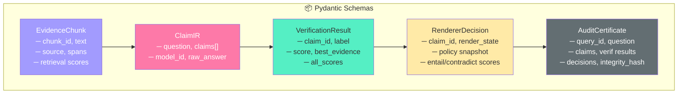
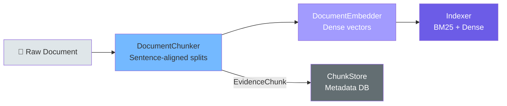
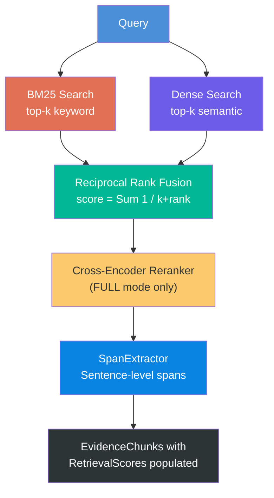
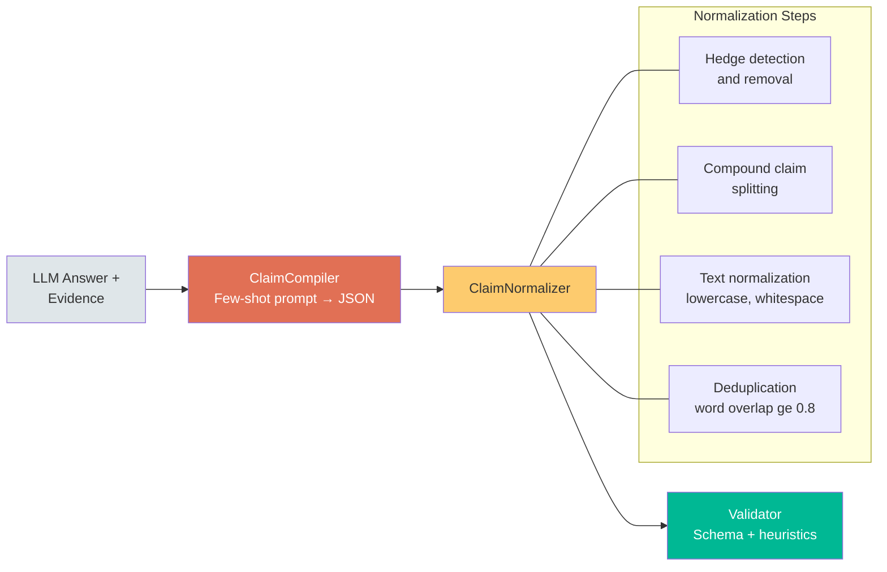
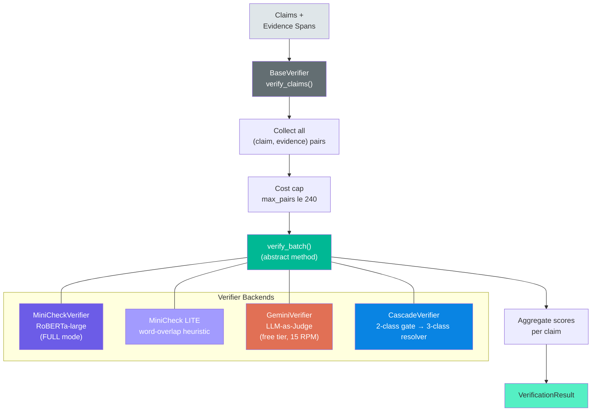
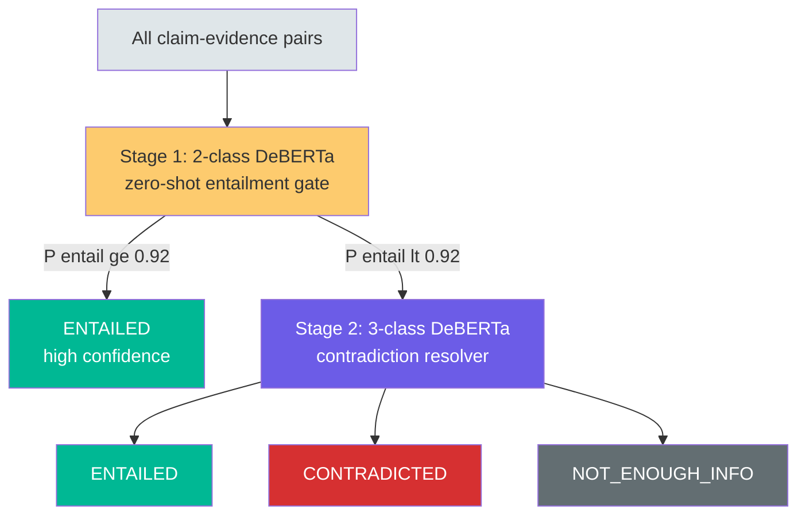
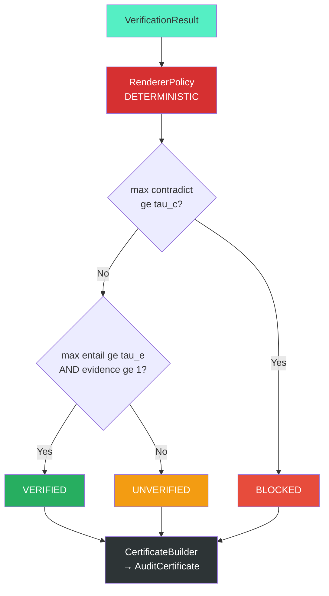
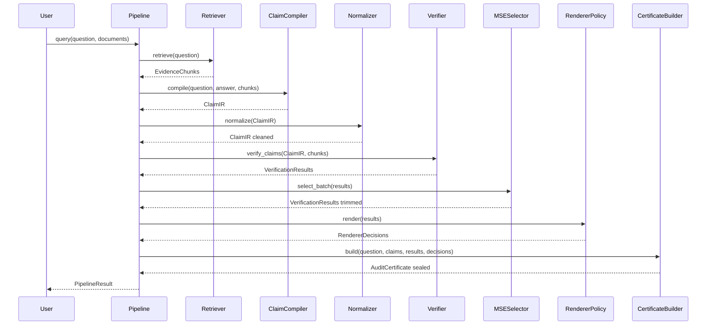
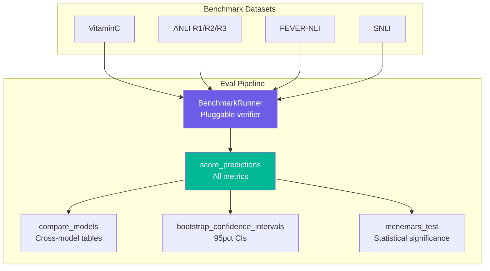
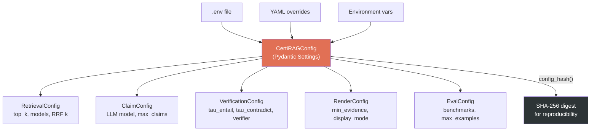

# CertiRAG — Complete Architecture & Codebase Walkthrough

> **Fail-Closed Grounding for RAG with Verified Rendering**
>
> CertiRAG decomposes LLM answers into atomic claims, verifies each claim against retrieved evidence, and renders only verified claims with a trust badge — enforced at the presentation layer, not by the LLM.

---

## 1. High-Level Architecture


The pipeline is orchestrated by [`CertiRAGPipeline`](certirag/pipeline.py) with 7 sequential stages. Every stage feeds structured Pydantic objects to the next — no raw LLM output ever reaches the renderer.

---

## 2. Execution Modes

| Aspect | **LITE** (CPU / API) | **FULL** (GPU) |
|---|---|---|
| Embeddings | OpenAI API | sentence-transformers (local) |
| Dense Index | NumPy brute-force | FAISS |
| Sentence Splitting | Regex | spaCy |
| Claim Compiler | OpenAI / Gemini API | Local HuggingFace model |
| Verifier | Word-overlap heuristic | MiniCheck / Cascade / Gemini |
| Reranker | ❌ Disabled | Cross-encoder reranking |

Controlled by `execution_mode` in [`config.py`](certirag/config.py).

---

## 3. Data Model Flow



Schema files:

- [`evidence.py`](certirag/schemas/evidence.py) — `SourceInfo`, `RetrievalScores`, `EvidenceSpan`, `EvidenceChunk`
- [`claim_ir.py`](certirag/schemas/claim_ir.py) — `ClaimType`, `Claim`, `ClaimIR`
- [`verification.py`](certirag/schemas/verification.py) — `VerificationLabel`, `EvidenceScore`, `VerificationResult`
- [`certificate.py`](certirag/schemas/certificate.py) — `RenderState`, `PolicySnapshot`, `RendererDecision`, `AuditCertificate`

---

## 4. Module Deep-Dives

### 4.1 Ingest Pipeline



| File | Class | Key Behavior |
|---|---|---|
| [`chunker.py`](certirag/ingest/chunker.py) | `DocumentChunker` | Sentence-aligned chunks with **character offsets**. Invariant: `chunk.text[span.start:span.end] == span.sentence` |
| [`embedder.py`](certirag/ingest/embedder.py) | `DocumentEmbedder` | L2-normalized embeddings (OpenAI API or sentence-transformers) |
| [`indexer.py`](certirag/ingest/indexer.py) | `BM25Index`, `DenseIndex`, `ChunkStore` | BM25 (rank_bm25), FAISS/NumPy dense, metadata store |

---

### 4.2 Retrieval



| File | Class | Key Behavior |
|---|---|---|
| [`hybrid.py`](certirag/retrieve/hybrid.py) | `HybridRetriever` | BM25 + dense → RRF fusion → cross-encoder rerank (FULL) |
| [`hybrid.py`](certirag/retrieve/hybrid.py) | `SimpleRetriever` | BM25-only fallback for LITE mode |
| [`span_extractor.py`](certirag/retrieve/span_extractor.py) | `SpanExtractor` | Validates sentence spans with T-U4 offset invariant |

---

### 4.3 Claim Compilation & Normalization



| File | Class | Key Behavior |
|---|---|---|
| [`compiler.py`](certirag/claim_ir/compiler.py) | `ClaimCompiler` | Decomposes LLM answers into atomic `ClaimIR` via structured prompts |
| [`gemini_compiler.py`](certirag/claim_ir/gemini_compiler.py) | `GeminiClaimCompiler` | Alternative using Gemini API (free tier) |
| [`normalizer.py`](certirag/claim_ir/normalizer.py) | `ClaimNormalizer` | Hedge removal, splitting, dedup, text normalization |
| [`validator.py`](certirag/claim_ir/validator.py) | Functions | JSON schema validation + atomicity heuristics |

---

### 4.4 Verification



| File | Class | Key Behavior |
|---|---|---|
| [`verifier.py`](certirag/verify/verifier.py) | `BaseVerifier` (ABC) | Pair collection → cost cap → batch scoring → aggregation |
| [`minicheck.py`](certirag/verify/minicheck.py) | `MiniCheckVerifier` | RoBERTa-large NLI model (~400M params); LITE heuristic fallback |
| [`gemini_verifier.py`](certirag/verify/gemini_verifier.py) | `GeminiVerifier` | LLM-as-Judge via Gemini 2.0 Flash; rate-limited |
| [`cascade_verifier.py`](certirag/verify/cascade_verifier.py) | `CascadeVerifier` | **Novel**: 2-class DeBERTa gate (fast entailment) → 3-class DeBERTa resolver (contradiction detection) |
| [`calibrator.py`](certirag/verify/calibrator.py) | `VerifierCalibrator` | Temperature scaling or isotonic regression; ECE computation |
| [`mse.py`](certirag/verify/mse.py) | `MSESelector` | Minimal Sufficient Evidence: greedy span selection until τ\_entail met |

#### Cascade Verifier Architecture (Novel Contribution)



> **Why cascade?** The 2-class model has 96.7% binary accuracy but cannot detect contradictions (F1=0). The 3-class model detects contradictions (F1=0.748) but is conservative on entailment. The cascade **routes** rather than **blends**, avoiding dilution of the 3-class signal.

---

### 4.5 Rendering & Policy Engine



**Theorem 1 (Fail-Closed):**

```
VERIFIED ⟺ (entail ≥ τ_e) ∧ (¬contradict ≥ τ_c) ∧ (evidence ≥ 1)
```

> **Important:** The renderer is the **trust boundary**. It reads **only** from `VerificationResult` objects, never from raw LLM output. The LLM cannot influence badge assignment.

| File | Class | Key Behavior |
|---|---|---|
| [`policy.py`](certirag/render/policy.py) | `RendererPolicy` | Deterministic decision logic; display modes: strict / mixed / debug |
| [`certificate.py`](certirag/render/certificate.py) | `CertificateBuilder` | Builds sealed `AuditCertificate` with integrity hash; supports verification |

---

## 5. End-to-End Pipeline Flow



---

## 6. Evaluation Framework



| File | Purpose |
|---|---|
| [`benchmark.py`](eval/benchmark.py) | `BenchmarkRunner` — pluggable verifier evaluation against NLI datasets |
| [`scoring.py`](eval/scoring.py) | `score_predictions()` — accuracy, P/R/F1, AUROC, ECE, confusion matrix, bootstrap CIs, McNemar's test |
| [`metrics.py`](eval/metrics.py) | Shared metrics: faithfulness rate, AUROC, ECE, verification yield, MSE efficiency, latency stats |
| [`runner.py`](eval/runner.py) | `EvalRunner` — end-to-end pipeline evaluation on ALCE, RAGTruth, AggreFact |

---

## 7. Configuration System



Defined in [`config.py`](certirag/config.py). Defaults are tuned for LITE mode (Codespaces-friendly).

---

## 8. UI (Streamlit Dashboard)

[`app.py`](ui/app.py) provides a glassmorphic dark-themed interface with:

| Section | Function | Purpose |
|---|---|---|
| Sidebar | `render_sidebar()` | Mode selection, threshold sliders, API key input |
| Hero | `render_hero()` | Branding banner |
| Pipeline Steps | `render_pipeline_steps()` | Visual progress indicator |
| Metrics | `render_metrics()` | Verified / Unverified / Blocked counts |
| Claim Cards | `render_claims()` | Color-coded claim cards with scores |
| Evidence | `render_evidence()` | Evidence explorer with highlighted spans |
| Verification | `render_verification_detail()` | Per-claim NLI score breakdown |
| Certificate | `render_certificate()` | JSON audit certificate viewer |

---

## 9. Key Design Decisions

| Decision | Rationale |
|---|---|
| **Fail-closed rendering** | LLM output never controls trust badges — safety invariant |
| **Sentence-level spans with offsets** | Enables precise UI highlighting; `chunk.text[start:end] == sentence` |
| **RRF fusion** | Robust combination of BM25 + dense without score normalization |
| **Cascade verifier** | Routes (not blends) — avoids 2-class model diluting contradiction signal |
| **MSE selection** | Minimizes certificate size while preserving verification quality |
| **Sealed certificates** | SHA-256 integrity hash enables tamper detection |
| **LITE/FULL modes** | Development on CPU, production on GPU — same pipeline, different backends |
| **Pydantic schemas** | Type safety + JSON schema export + automatic validation throughout |
| **Config hashing** | Exact SHA-256 of all params → bit-for-bit reproducibility tracking |

---

## 10. Repository Map

```
CertiRAG/
├── certirag/                  # Core package
│   ├── __init__.py            # Architecture overview
│   ├── pipeline.py            # 7-step orchestrator
│   ├── config.py              # Pydantic Settings configuration
│   ├── cli.py                 # CLI: ingest, run, eval, validate
│   ├── utils.py               # Seeds, hashing, logging, I/O
│   ├── schemas/               # Pydantic data models
│   │   ├── evidence.py        # EvidenceChunk, EvidenceSpan
│   │   ├── claim_ir.py        # ClaimIR, Claim, ClaimType
│   │   ├── verification.py    # VerificationResult, EvidenceScore
│   │   └── certificate.py     # AuditCertificate, RendererDecision
│   ├── ingest/                # Document processing
│   │   ├── chunker.py         # Sentence-aligned chunking
│   │   ├── embedder.py        # Dense embeddings
│   │   └── indexer.py         # BM25 + FAISS/NumPy indices
│   ├── retrieve/              # Evidence retrieval
│   │   ├── hybrid.py          # RRF fusion + cross-encoder reranking
│   │   └── span_extractor.py  # Sentence span extraction/validation
│   ├── claim_ir/              # Claim decomposition
│   │   ├── compiler.py        # LLM → atomic claims
│   │   ├── gemini_compiler.py # Gemini API variant
│   │   ├── normalizer.py      # Hedging, splitting, dedup
│   │   └── validator.py       # Schema + heuristic validation
│   ├── verify/                # Fact verification
│   │   ├── verifier.py        # BaseVerifier ABC
│   │   ├── minicheck.py       # MiniCheck (RoBERTa-large)
│   │   ├── gemini_verifier.py # LLM-as-Judge (Gemini)
│   │   ├── cascade_verifier.py# 2-stage cascade (novel)
│   │   ├── calibrator.py      # Score calibration (Platt/isotonic)
│   │   └── mse.py             # Minimal Sufficient Evidence
│   └── render/                # Trust boundary
│       ├── policy.py          # Deterministic policy engine
│       └── certificate.py     # Audit certificate builder
├── eval/                      # Evaluation framework
│   ├── benchmark.py           # BenchmarkRunner
│   ├── scoring.py             # Metrics + bootstrap CIs + McNemar
│   ├── metrics.py             # Shared metric functions
│   └── runner.py              # End-to-end eval orchestrator
├── ui/
│   └── app.py                 # Streamlit dashboard
├── configs/                   # YAML config presets
├── tests/                     # Test suite
└── notebooks/                 # Analysis notebooks
```
