# CertiRAG Architecture & Data Flow Diagrams

This document contains Mermaid diagrams describing the CertiRAG system.

---

## 1. High-Level Pipeline Architecture

```mermaid
flowchart TB
    subgraph Ingestion ["📥 Ingestion (Offline)"]
        D[/"Documents"/] --> CH["DocumentChunker<br/><i>sentence splitting</i>"]
        CH --> EMB["DocumentEmbedder<br/><i>dense vectors</i>"]
        EMB --> IDX["ChunkStore + BM25Index<br/>+ DenseIndex"]
    end

    subgraph Pipeline ["🔄 CertiRAG Pipeline (Online)"]
        Q[/"User Query"/] --> RET["HybridRetriever<br/><i>BM25 + Dense + RRF</i>"]
        RET --> SE["SpanExtractor<br/><i>sentence-level spans</i>"]
        SE --> CC["ClaimCompiler<br/><i>LLM decomposition</i>"]
        CC --> CN["ClaimNormalizer<br/><i>split · dehedge · dedup</i>"]
        CN --> VER["Verifier (MiniCheck)<br/><i>entail / contradict / neutral</i>"]
        VER --> MSE["MSESelector<br/><i>greedy minimal evidence</i>"]
        MSE --> RP["RendererPolicy<br/><i>Theorem 1 decision</i>"]
        RP --> CB["CertificateBuilder<br/><i>SHA-256 sealed audit</i>"]
    end

    IDX -.->|"chunk store"| RET
    CB --> CERT[/"AuditCertificate<br/>+ Rendered Answer"/]

    style Ingestion fill:#e8f5e9,stroke:#388e3c,stroke-width:2px
    style Pipeline fill:#e3f2fd,stroke:#1565c0,stroke-width:2px
    style CERT fill:#fff3e0,stroke:#ef6c00,stroke-width:2px
```

---

## 2. Data Schema Relationships

---

## 3. Verification & Render Decision Flow (Theorem 1)

```mermaid
flowchart TD
    START(["Claim c<sub>i</sub> + Evidence E"]) --> ENT{"entail_score ≥ τ<sub>e</sub>?"}
    ENT -->|Yes| CONT{"contradict_score < τ<sub>c</sub>?"}
    ENT -->|No| UNVER["🟡 UNVERIFIED<br/><i>Insufficient support</i>"]
    CONT -->|Yes| EVID{"evidence_spans ≥ min?"}
    CONT -->|No| BLOCK["🔴 BLOCKED<br/><i>Contradiction detected</i>"]
    EVID -->|Yes| VER["🟢 VERIFIED<br/><i>Claim passes all gates</i>"]
    EVID -->|No| UNVER

    style VER fill:#c8e6c9,stroke:#2e7d32,stroke-width:2px
    style UNVER fill:#fff9c4,stroke:#f9a825,stroke-width:2px
    style BLOCK fill:#ffcdd2,stroke:#c62828,stroke-width:2px
    style START fill:#e1f5fe,stroke:#0277bd,stroke-width:2px
```

### Formal Definition (Theorem 1)

$$
\text{VERIFIED}(c_i) \iff \bigl(\hat{p}_{\text{entail}}(c_i) \ge \tau_e\bigr) \;\wedge\; \bigl(\hat{p}_{\text{contradict}}(c_i) < \tau_c\bigr) \;\wedge\; \bigl(|E_{\text{MSE}}(c_i)| \ge 1\bigr)
$$

- **Fail-closed guarantee**: If any condition is not met, the claim is **not** rendered as verified.
- **BLOCKED** is stronger than UNVERIFIED — it means evidence actively contradicts the claim.

---

## 4. Hybrid Retrieval Strategy

---

## 5. MSE (Minimal Sufficient Evidence) Selection

```mermaid
flowchart TD
    IN["All evidence spans<br/>for claim c<sub>i</sub>"] --> SORT["Sort by<br/>entail score ↓"]
    SORT --> INIT["S ← ∅"]
    INIT --> LOOP{"Combined score<br/>of S ≥ τ?"}
    LOOP -->|No| ADD["Add next-best<br/>span to S"]
    ADD --> LOOP
    LOOP -->|Yes| OUT["Return S as<br/>MSE set"]
    OUT --> CHECK{"Verify<br/>|S| ≥ min_spans?"}
    CHECK -->|Yes| DONE["✅ MSE complete"]
    CHECK -->|No| PAD["Add more spans<br/>until min met"]
    PAD --> DONE

    style IN fill:#e1f5fe,stroke:#0277bd
    style DONE fill:#c8e6c9,stroke:#2e7d32
```

---

## 6. Evaluation & Ablation Framework

```mermaid
flowchart TB
    subgraph Datasets ["📊 Evaluation Datasets"]
        ALCE["ALCE<br/><i>citation verification</i>"]
        RAG["RAGTruth<br/><i>hallucination detection</i>"]
        AGG["AggreFact<br/><i>factual consistency</i>"]
    end

    subgraph Metrics ["📏 Metrics"]
        M1["claim_precision"]
        M2["claim_recall"]
        M3["claim_f1"]
        M4["faithfulness_rate"]
        M5["mean_evidence_sufficiency"]
        M6["certificate_completeness"]
        M7["MSE_compression_ratio"]
        M8["deniability_gap"]
    end

    subgraph Ablations ["🔬 Ablation Studies"]
        A1["Verifier: MiniCheck<br/>vs NLI vs LLM-judge"]
        A2["Threshold sweep<br/>τ_e, τ_c grid search"]
        A3["Retrieval: BM25-only<br/>vs Dense-only vs Hybrid"]
        A4["±MSE ablation"]
        A5["±Normalization ablation"]
    end

    Datasets --> Runner["EvalRunner<br/><i>orchestrates evaluation</i>"]
    Runner --> Metrics
    Runner --> Ablations
    Ablations --> Plots["Publication Plots<br/><i>matplotlib/seaborn</i>"]

    style Datasets fill:#e8f5e9,stroke:#388e3c
    style Metrics fill:#fff3e0,stroke:#ef6c00
    style Ablations fill:#f3e5f5,stroke:#7b1fa2
```

---

## 7. Dual Execution Modes

```mermaid
flowchart LR
    subgraph LITE ["☁️ LITE Mode (Codespaces)"]
        L1["CPU-only execution"]
        L2["OpenAI API embeddings"]
        L3["NumPy cosine search"]
        L4["Cross-encoder: skip"]
        L5["MiniCheck via API"]
    end

    subgraph FULL ["🖥️ FULL Mode (Colab Pro)"]
        F1["GPU acceleration"]
        F2["Local sentence-transformers"]
        F3["FAISS GPU index"]
        F4["Cross-encoder reranking"]
        F5["Local MiniCheck model"]
    end

    CONFIG["CertiRAGConfig<br/><i>execution_mode</i>"] --> LITE
    CONFIG --> FULL

    LITE --> SAME["Same verification<br/>guarantees ✅"]
    FULL --> SAME

    style LITE fill:#e3f2fd,stroke:#1565c0,stroke-width:2px
    style FULL fill:#fce4ec,stroke:#c62828,stroke-width:2px
    style SAME fill:#c8e6c9,stroke:#2e7d32,stroke-width:2px
```

---

## 8. Certificate Integrity & Audit Trail

```mermaid
sequenceDiagram
    participant P as Pipeline
    participant CB as CertificateBuilder
    participant V as Validator

    P->>CB: build(question, answer, decisions, config)
    CB->>CB: Compute config_hash = SHA256(config)
    CB->>CB: Aggregate stats (verified/blocked/unverified)
    CB->>CB: Serialize certificate body
    CB->>CB: seal = SHA256(body)
    CB-->>P: AuditCertificate

    Note over P,V: Later verification...

    P->>V: validate(certificate)
    V->>V: Recompute SHA256(body)
    V->>V: Compare with stored seal
    alt Seal matches
        V-->>P: ✅ Certificate valid
    else Seal mismatch
        V-->>P: ❌ Tampered / invalid
    end
```

